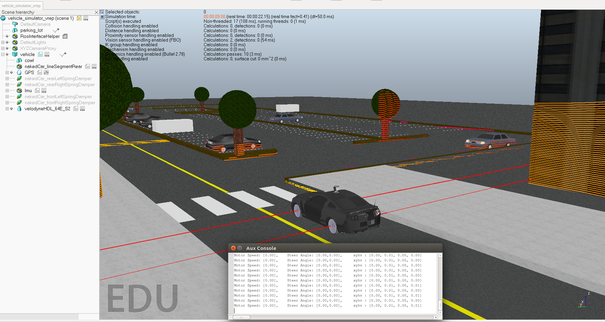
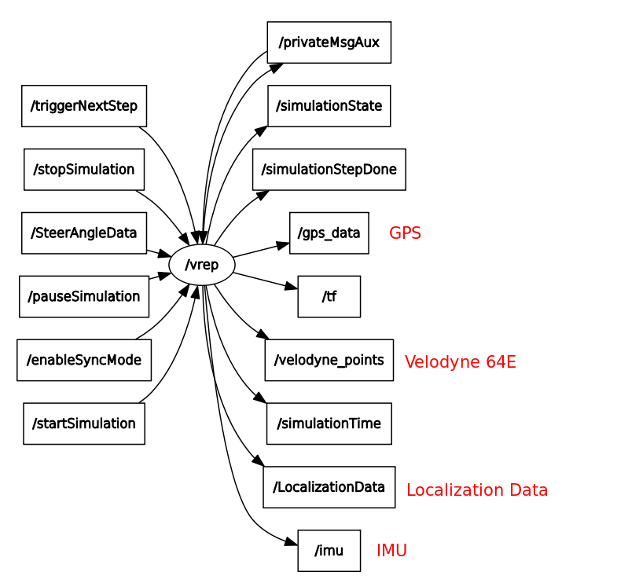
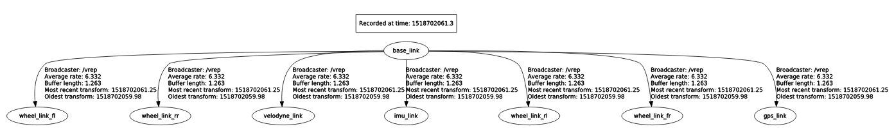

# V-Rep-Autonomous-Vehicle-Simulator

## It's built for Autonomous Vehicle Simulator using V-Rep & ROS simultaneously
It publishes data `Velodyne PointCloud`, `IMU Sensor`, `GPS`, `Localization (X,Y,Z,Heading)`, `Transform (tf)`  
to ROS at the same time as soon as you run the simulation.  

   
## Topic 

  

## Transform Tree(tf tree)

I've used IMU Plugin & Velodyne Plugin from 
https://github.com/bartville/vrep_plugin_imu
https://github.com/omcandido/vrep_plugin_velodyne
  

feel free to use as a simulator and if you find any bug while using, report me please Thx :-)
